# Using Stackdriver* with golang on Istio

This is a simplification of  [https://github.com/GoogleCloudPlatform/istio-samples/tree/master/istio-stackdriver](https://github.com/GoogleCloudPlatform/istio-samples/tree/master/istio-stackdriver) as a 'hello world' type application.  The istio sample for Stackdriver uses the [microservices-demo](https://github.com/GoogleCloudPlatform/microservices-demo) application.  The microservices demo is nice but includes a lot of things i don't find necessary to understand specific technologies.

I find using a simple frontend->backend reference as instructive for me to learn so i setup
- [https://github.com/salrashid123/istio_helloworld](https://github.com/salrashid123/istio_helloworld) sometime ago to learn istio.  Now i'm combining much of the same code to help explain various `StackDriver` technologies

Specifically, this repo explores using the following on [GKE with Istio](https://cloud.google.com/istio/docs/istio-on-gke/overview)

- [Stackdriver Logging](https://cloud.google.com/logging/)
- [Stackdriver Monitoring](https://cloud.google.com/monitoring/docs/)
- [Stackdriver Trace](https://cloud.google.com/trace/)
- [Stackdriver Error Reporting](https://cloud.google.com/error-reporting/)
- [Stackdriver Profiler](https://cloud.google.com/profiler/)
- [Stackdriver Debugger](https://cloud.google.com/debugger//)*
- [Opencensus Exporter for Stackdriver](https://opencensus.io/exporters/supported-exporters/go/stackdriver/#creating-the-exporter)

and along the way, we will cover

- [Istio Traffic Management](https://istio.io/docs/concepts/traffic-management/)
- [Istio Fault Injection](https://istio.io/docs/tasks/traffic-management/fault-injection/)

You can pretty much pick and choose what you're interested in but using this repo requires a significant invenstment in setup.

## Testing endpoints

- Frontend (`fe`):

```golang
http.Handle("/", rootHandler)   // does nothing
http.Handle("/hostname", hostnameHander)  // emits back the hostname of the pod that got the request
http.Handle("/tracer", traceHandler)  // starts tracing requests to gcs and makes a call to the backend /tracer endpoint
http.Handle("/backend", backendHandler)  // just makes an http call to the backend
http.Handle("/log", logHandler)  // logs stuff
http.Handle("/delay", delayHandler) // adds in an artifical delay of 3s by default.  Accepts ?delay=2000 to daly 2s,etc
http.Handle("/error", errorHandler)  // emits a custom error
http.Handle("/debug", debugHandler)  // debug endpoint where you can setup a breakpoint (well, you can set one anywhere...)
http.Handle("/measure", trackVistHandler(measureHandler))  // emits a custom metric to opencensus-->stackdriver
```

- Backend (`be`):

```golang
http.HandleFunc("/tracer", tracer)  // accepts an inbound trace context from frontend, used context to make a gcs call and then return
http.HandleFunc("/backend", backend) // just responds, ok
```

## Setup

The setup is long, but we are going to cover a lot...

```bash
export PROJECT_ID=`gcloud config get-value core/project`
export PROJECT_NUMBER=`gcloud projects describe $PROJECT_ID --format="value(projectNumber)"`
```

### Configure Project

#### Enable Services

```bash
gcloud services enable   cloudtrace.googleapis.com   compute.googleapis.com   container.googleapis.com   logging.googleapis.com   monitoring.googleapis.com   sourcerepo.googleapis.com   stackdriver.googleapis.com    clouddebugger.googleapis.com   clouderrorreporting.googleapis.com   cloudprofiler.googleapis.com
```

#### Add IAM permissions

```bash
gcloud iam service-accounts list

$PROJECT_NUMBER-compute@developer.gserviceaccount.com
```

```
$ gcloud iam service-accounts list
NAME                                    EMAIL                                               DISABLED
Compute Engine default service account  404271327512-compute@developer.gserviceaccount.com  False
```

Add permission to default compute service account:  
- Stackdriver Debugger Agent
- Stackdriver Profiler Agent
- Cloud Trace Agent
- Kubernetes Engine Admin
- Errors Writer
- Logs Writer
- Monitoring Metric Writer
- Monitoring Editor

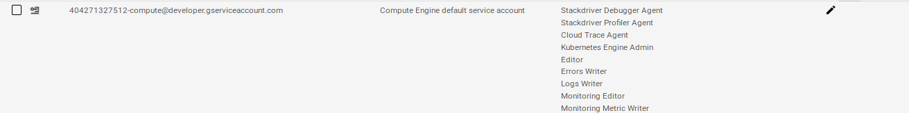

#### Create GCS bucket

Create bucket to upload a sample test file (this is used later for tracing demo)

```
gsutil mb gs://sdtest-$PROJECT_NUMBER

$ echo foo > some_file.txt
$ gsutil cp some_file.txt gs://sdtest-$PROJECT_NUMBER
```

Add permissions to the service account `$PROJECT_NUMBER-compute@developer.gserviceaccount.com`

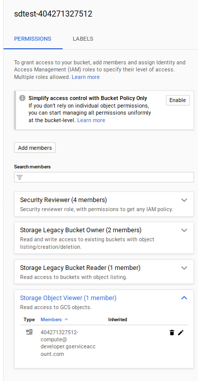

### Install GKE+Istio

Install GKE an the istio plugin.  

Note, the supported version here is pinned and confirmed working

- [Supported Versions](https://cloud.google.com/istio/docs/istio-on-gke/installing#supported_gke_cluster_versions)
 --> Istio on GKE Version: 1.1.7-gke.0

```bash
export GKE_ISTIO_VERSION=1.1.7-gke.0
```

Deploy the cluster and enable some additional scopes:

```bash
gcloud beta container  clusters create gcp-demo --machine-type "n1-standard-2" --zone us-central1-a  --num-nodes 4 --enable-ip-alias  --enable-stackdriver-kubernetes --scopes "https://www.googleapis.com/auth/cloud-platform","https://www.googleapis.com/auth/devstorage.read_only","https://www.googleapis.com/auth/logging.write","https://www.googleapis.com/auth/monitoring","https://www.googleapis.com/auth/servicecontrol","https://www.googleapis.com/auth/service.management.readonly","https://www.googleapis.com/auth/trace.append,https://www.googleapis.com/auth/cloud_debugger","https://www.googleapis.com/auth/monitoring.write" --addons=Istio --istio-config=auth=MTLS_PERMISSIVE --cluster-version=1.13.7

gcloud container clusters get-credentials gcp-demo --zone us-central1-a

kubectl create clusterrolebinding cluster-admin-binding --clusterrole=cluster-admin --user=$(gcloud config get-value core/account)
```

#### Add Kiali

Install Kaili for topology graphs with [options](https://istio.io/docs/reference/config/installation-options/#kiali-options)


First add prometheus to gke+istio since its not installed by default

```bash
curl https://storage.googleapis.com/gke-release/istio/release/1.0.3-gke.3/patches/install-prometheus.yaml | kubectl apply -n istio-system -f -
```

Now add in kaili configs.  `kaili.path` installs just the Kaili from the options.  To see how the `.path` file is generated, see Appendix section
```
cd istio_install
kubectl apply -f kiali_secret.yaml
kubectl apply -f kiali.patch
```


Start UI (username/password is `admin`/`admin`)

```bash
kubectl -n istio-system port-forward $(kubectl -n istio-system get pod -l app=kiali -o jsonpath='{.items[0].metadata.name}') 20001:20001
```

#### Add Stackdriver Trace

Add on configuration to gke+istio for [enhanced stackdriver tracing](https://cloud.google.com/istio/docs/istio-on-gke/installing#tracing_and_logging):


```
kubectl edit -n istio-system rule stackdriver-tracing-rule
```
Find the line `match: "false"` and replace with

```match: context.protocol == "http" || context.protocol == "grpc"```


#### Register GCE Metadataserver and Services

Register Istio VirtualServices for `MESH_EXTERNAL` endpoints so we can see them in the UI
```
cd deploy_configs/
kubectl apply -f istio-egress-metadata.yaml
kubectl apply -f istio-egress-googleapis.yaml
```


#### Optionally Enable REGISTRY_ONLY Egress Policy

By default, istio+gke allows all outbound traffic.  We're paranoid so lets turn that off and only allow `REGISTRY_ONLY`

- [Istio Egress](https://istio.io/docs/tasks/traffic-management/egress/egress-control/)

Shows we allow by default
```
  $ kubectl get configmap istio -n istio-system -o yaml | grep -o "mode: ALLOW_ANY"
    mode: ALLOW_ANY
    mode: ALLOW_ANY
```

so, runt he command here to enable registry:
- REGISTRY_ONLY:
   `kubectl get configmap istio -n istio-system -o yaml | sed 's/mode: REGISTRY_ONLY/mode: ALLOW_ANY/g' | kubectl replace -n istio-system -f -`

(to revert it, you can always run)
- ALLOW_ANY:
  `kubectl get configmap istio -n istio-system -o yaml | sed 's/mode: ALLOW_ANY/mode: REGISTRY_ONLY/g' | kubectl replace -n istio-system -f -`

### (Optional) Setup Source Repo for Cloud Debugger

Now setup a cloud source repo to support the debugger.  If you are not interested in Cloud Debugger, skip this step

If you want to manually select the source, skip this step and follow
- [Selecting Source Code Manually](https://cloud.google.com/debugger/docs/source-options)

Otherwise

```bash
# create directory off of the git root
mkdir stage/
cd stage/
gcloud source repos create fe
gcloud source repos clone fe

cd fe
_cp -R contents of  `minimal_gcp/fe/*` into the source repo folder
git add -A
git commit -m "update"
git push
```

Now acquire the source context file

```bash
$  gcloud debug source gen-repo-info-file --output-directory /tmp/src_context/
```

It will look something like:

```bash
$ cat /tmp/src_context/source-context.json
{
  "cloudRepo": {
    "repoId": {
      "projectRepoId": {
        "projectId": "$PROJECT",
        "repoName": "fe"
      }
    },
    "revisionId": "913f3cf0d8f36fd472a4538e9c8025d6df4e14ee"
  }
}
```

Edit `debug-configmap.yaml` with the source context information

- debug-configmap.yaml
```yaml
apiVersion: v1
kind: ConfigMap
metadata:
  name: debug-configmap
data:
  config: |-
    {
      "cloudRepo": {
        "repoId": {
          "projectRepoId": {
            "projectId": "$PROJECT",
            "repoName": "fe"
          }
        },
        "revisionId": "913f3cf0d8f36fd472a4538e9c8025d6df4e14ee"
      }
    }
```

### Build and push images

Now we're ready to build and push the images to your won gcr.io repo.  If you would rather use an image i setup, you can find them at

* `docker.io/salrashid123/fe_min`
* `docker.io/salrashid123/be_min`

```bash
cd minimal_gcp/fe
docker build  --build-arg VER=1 -f Dockerfile.prod -t gcr.io/$PROJECT_ID/fe_min:1 .
docker build  --build-arg VER=2 -f Dockerfile.prod -t gcr.io/$PROJECT_ID/fe_min:2 .
docker push gcr.io/$PROJECT_ID/fe_min:1
docker push gcr.io/$PROJECT_ID/fe_min:2

docker build  --build-arg VER=1 -f Dockerfile.debug -t gcr.io/$PROJECT_ID/fe_min:debug1 .
docker build  --build-arg VER=2 -f Dockerfile.debug -t gcr.io/$PROJECT_ID/fe_min:debug2 .
docker push gcr.io/$PROJECT_ID/fe_min:debug1
docker push gcr.io/$PROJECT_ID/fe_min:debug2
```

```bash
cd minimal_gcp/be
docker build  --build-arg VER=1 -f Dockerfile -t gcr.io/$PROJECT_ID/be_min:1 .
docker build  --build-arg VER=2 -f Dockerfile -t gcr.io/$PROJECT_ID/be_min:2 .
docker push  gcr.io/$PROJECT_ID/be_min:1
docker push  gcr.io/$PROJECT_ID/be_min:2
```

---


### Deploy Application

We're finally ready to deploy the app

- First get the `GATEWAY_IP`
```
export GATEWAY_IP=$(kubectl -n istio-system get service istio-ingressgateway -o jsonpath='{.status.loadBalancer.ingress[0].ip}')
echo $GATEWAY_IP
```

### Edit configmap.yaml, debug-configmap.yaml

Open and editor and modify `configmap.yaml` values for the project, gcs bucket you created and the gke cluster name

If you setup cloud source repo and for the debugger, edit `debug-configmap.yaml`


### Prepare istio for ingress

The following step sets up istio for ingress to our test application

```bash
cd deploy_configs/

kubectl label namespace default istio-injection=enabled

kubectl apply -f istio-lb-certs.yaml
```

(wait a couple seconds)
```
kubectl apply -f istio-ingress-gateway.yaml
kubectl apply -f istio-services.yaml
kubectl apply -f configmap.yaml
kubectl apply -f debug-configmap.yaml
kubectl apply -f istio-deployment.yaml
```
The inital `istio-deployment.yaml` creates

* `fe:v1`:  1 replica
* `fe:v2`:  0 replica
* `be:v1`:  1 replica
* `be:v2`:  0 replica

#### 1. Deploy fev1->bev1

Ok, now we can finally see the endpoint.

The first test is to check traffic:

`user` --> `istio-gateway` --> `fe:v1`

```bash
kubectl apply -f istio-fev1-bev1.yaml
```

- Check Frontend

```bash
for i in {1..10}; do curl -sk -w "\n" -s http://$GATEWAY_IP/hostname &&  sleep 1; done

hello from myapp-v1-846c6988db-ptjld, i'm running version 1
hello from myapp-v1-846c6988db-ptjld, i'm running version 1
hello from myapp-v1-846c6988db-ptjld, i'm running version 1
hello from myapp-v1-846c6988db-ptjld, i'm running version 1
```

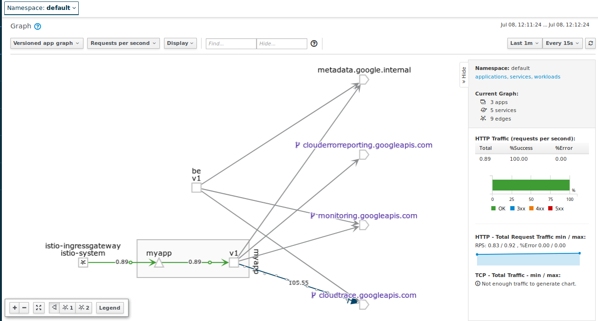

Ok, now send traffic to backend

`user` --> `istio-gateway` --> `fe:v1` --> `be:v1`

```bash
for i in {1..10}; do curl -sk -w "\n" -s http://$GATEWAY_IP/backend &&  sleep 1; done

Response from Backend: This is a response from Backend be-v1-77f6fff764-nwvzk running version 1
Response from Backend: This is a response from Backend be-v1-77f6fff764-nwvzk running version 1
Response from Backend: This is a response from Backend be-v1-77f6fff764-nwvzk running version 1
Response from Backend: This is a response from Backend be-v1-77f6fff764-nwvzk running version 1
```

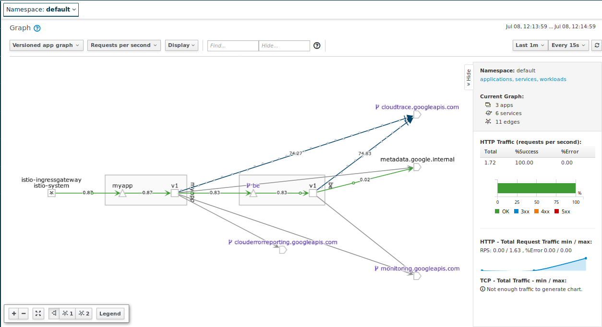

- Check Backend

```bash
for i in {1..10}; do curl -sk -w "\n" -s http://$GATEWAY_IP/trace &&  sleep 1; done
```

#### Deploy fev1v2->bev1, traffic split 50/50

Now bump up the instance count for `fev2`.

- Edit `-deployment.yaml`, set `myapp-v2` --> 1 replica

```yaml
apiVersion: extensions/v1beta1
kind: Deployment
metadata:
  name: myapp-v2
spec:
  replicas: 1
  template:
    metadata:
      labels:
        app: myapp
        version: v2
```

Apply the update
```
kubectl apply -f istio-deployment.yaml
```
You should see `fev2` as a target for the service but no traffic to i

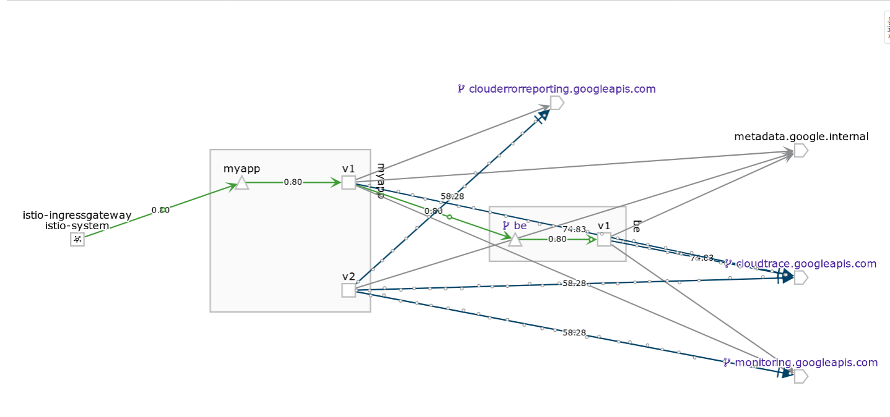


Finally, apply the virtual service to traffic split

```yaml
apiVersion: networking.istio.io/v1alpha3
kind: VirtualService
metadata:
  name: myapp-virtualservice
spec:
  hosts:
  - "*"
  gateways:
  - my-gateway
  - my-gateway-ilb  
  http:
  - route:
    - destination:
        host: myapp
        subset: v1
      weight: 50
    - destination:
        host: myapp
        subset: v2
      weight: 50
```

`kubectl apply -f istio-fev1v2-bev1.yaml`

You'll see 50/50 split on fev1:

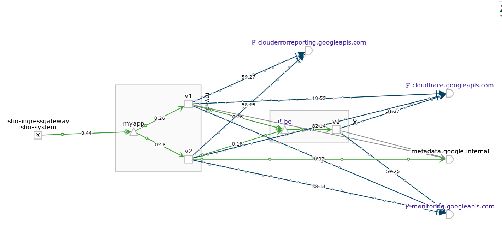


#### Deploy fev1v2->bev1v2, traffic split 50/50

Increase instance count of `bev2`.
- Edit `-deployment.yaml`, set `be-v2` --> 1 replica

```yaml
apiVersion: extensions/v1beta1
kind: Deployment
metadata:
  name: be-v2
  labels:
    type: be
    version: v2
spec:
  replicas: 1
  template:
    metadata:
      labels:
        app: be
```

Apply `kubectl apply -f istio-deployment.yaml`

Then allow traffic to `bev2`

```
kubectl apply -f istio-fev1v2-bev1v2.yaml
```

You should see responses from both backends

```bash
$ for i in {1..100}; do curl -sk -w "\n" -s http://$GATEWAY_IP/backend &&  sleep 1; done

Response from Backend: This is a response from Backend be-v1-77f6fff764-nwvzk running version 1
Response from Backend: This is a response from Backend be-v2-7c4566bc4b-2zgw4 running version 2
Response from Backend: This is a response from Backend be-v2-7c4566bc4b-2zgw4 running version 2
Response from Backend: This is a response from Backend be-v2-7c4566bc4b-2zgw4 running version 2
Response from Backend: This is a response from Backend be-v1-77f6fff764-nwvzk running version 1
Response from Backend: This is a response from Backend be-v1-77f6fff764-nwvzk running version 1
```

I've hardcoded backend v2 to add on an artificial latency

```golang
func backend(w http.ResponseWriter, r *http.Request) {
	log.Infof("...backend version %v called on %v", version, os.Getenv("MY_CONTAINER_NAME"))
	if version == "2" {
		log.Infof("...just doing nothing for... 1000ms")
		time.Sleep(time.Duration(1000) * time.Millisecond)
	}
	fmt.Fprintf(w, "This is a response from Backend %v running version %v", os.Getenv("MY_POD_NAME"), version)
}
```

Which means you will see that in kiali dashboard

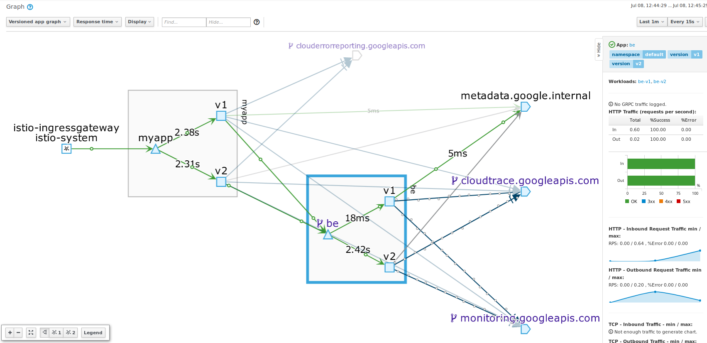


#### fev1v2->bev1v2 synthetic Errors

Now inject a synthetic fault into the picture.  Istio allows you to setup a 'fake' latency or error through its [Falutl Injection](https://istio.io/docs/tasks/traffic-management/fault-injection/) mechanism.

Edit
- `istio-fev1-bev1v2.yaml` and set `be*` to invent 30% `500` synthetic errors

```yaml
apiVersion: networking.istio.io/v1alpha3
kind: VirtualService
metadata:
  name: be-virtualservice
spec:
  gateways:
  - mesh
  hosts:
  - be
  http:    
  - route:
    - destination:
        host: be
        subset: v1
      weight: 50              
    - destination:
        host: be
        subset: v2
      weight: 50
    fault:
      abort:
        percent: 30
        httpStatus: 500  
```

Then see:

```bash
for i in {1..1000}; do curl -sk -w "\n" -s http://$GATEWAY_IP/backend &&  sleep 1; done

Response from Backend: This is a response from Backend be-v1-77f6fff764-g5tl4 running version 1
Response from Backend: This is a response from Backend be-v1-77f6fff764-g5tl4 running version 1
Response from Backend: fault filter abort
Response from Backend: This is a response from Backend be-v2-7c4566bc4b-2kfq7 running version 2
Response from Backend: This is a response from Backend be-v1-77f6fff764-g5tl4 running version 1
Response from Backend: fault filter abort
Response from Backend: fault filter abort
Response from Backend: This is a response from Backend be-v1-77f6fff764-g5tl4 running version 1
Response from Backend: This is a response from Backend be-v1-77f6fff764-g5tl4 running version 1
Response from Backend: This is a response from Backend be-v1-77f6fff764-g5tl4 running version 1
Response from Backend: This is a response from Backend be-v1-77f6fff764-g5tl4 running version 1
Response from Backend: This is a response from Backend be-v2-7c4566bc4b-2kfq7 running version 2
Response from Backend: fault filter abort
```

Observe these errors in Kiali

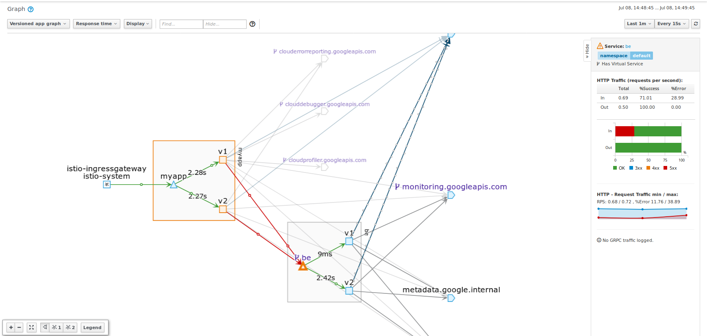

#### fev1v2->bev1v2 path based routing

You can continue this technique with other endpoints and even do path based routing.

For example you can define a rule which forces `/backend` to only go to `be:v1`.  For more information on that, see [istio helloworld Route Control](https://github.com/salrashid123/istio_helloworld#route-path)


The following section will cover how stackdriver helps surface more details to what was just done

---

### LOGGING

Since we enabled structured logging,

```golang
import (
  log "github.com/sirupsen/logrus"
)
...
	log.SetFormatter(&log.JSONFormatter{
		DisableTimestamp: true,
		FieldMap: log.FieldMap{
			log.FieldKeyLevel: "severity",
		},
	})
	log.SetOutput(os.Stdout)
	log.SetLevel(log.InfoLevel)
```

A log entry like the following:
```golang
	log.Printf("Found ENV lookup backend ip: %v port: %v\n", backendHost, backendPort)
```

Will get emitted as structured to stdout

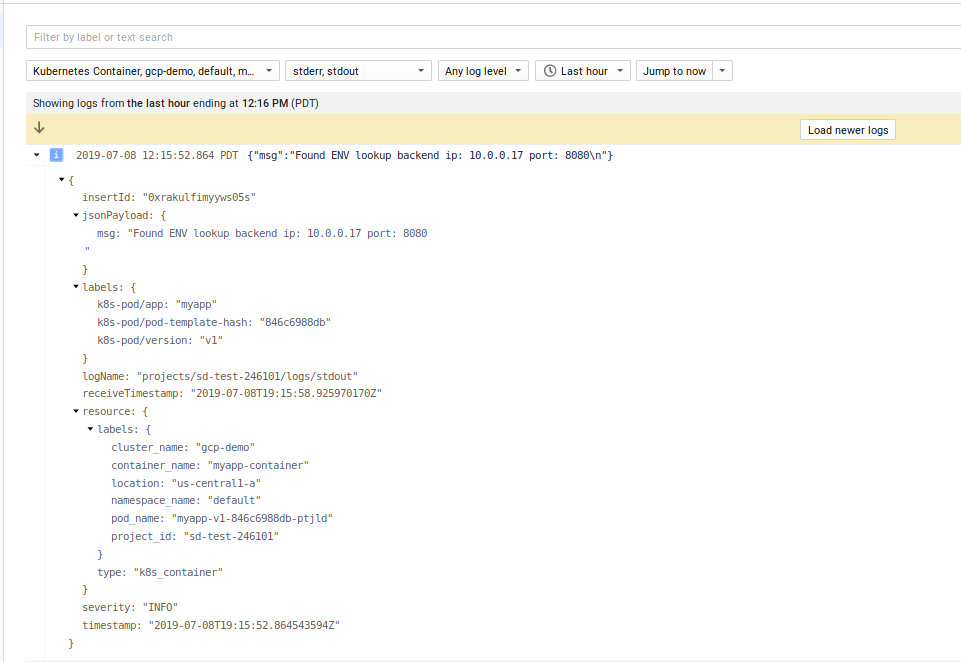

What is not shown is structured, correlated logging or the httpRequest proto.  For more information on that, see

- [Correlating Log Lines on GCP](https://medium.com/google-cloud/combining-correlated-log-lines-in-google-stackdriver-dd23284aeb29)
- [httpRequest.proto](https://cloud.google.com/logging/docs/reference/v2/rest/v2/LogEntry#HttpRequest)
- [GKE Logging Best Practices](https://cloud.google.com/monitoring/kubernetes-engine/legacy-stackdriver/logging#best_practices)


### TRACING

Tracing was enabled directly on the cluster so all istio statistics gets emitted.  You can see the default trace capability built in here:

The following just shows the latency we added on directly to `/backend`:
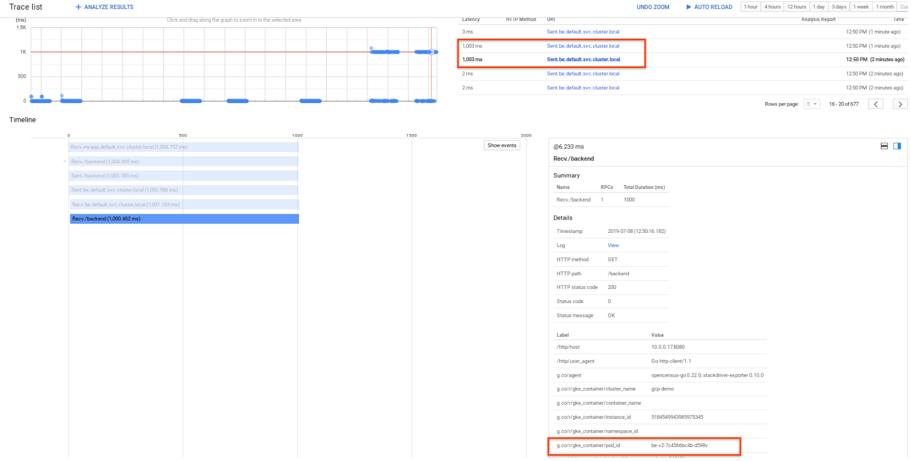

However, we also enabled the `/tracer` backend to emit 'in context' traces.   That is, we will emit custom spans from a frontend to the backend within the same span

For example

* `fe:/tracer`:   start span, retrieve a file from GCS, make a call to the `be:/tracer`
* `be:/tracer`:   start span, retrieve a file from GCS, respond back to the frontend

WHat we ill see is the actual API request, spans _TO_ GCS as well as the custom spans we setup

Now invoke the `/tracer` endpoint ont the frontend

```
 for i in {1..5}; do curl -sk -w "\n" -s http://$GATEWAY_IP/tracer &&  sleep 1; done
```

You'll see the full request flow described above

- `user`-> `fev1v2` (start span, make gcs api call, make request call to backend)
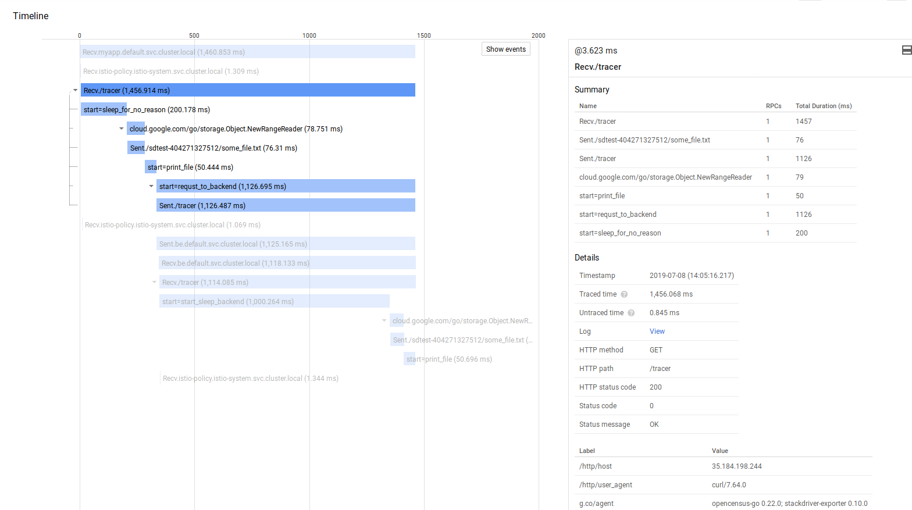

then on the same parent psan

- `fe`-> `bev1v2` (continue span, make gcs api call, return)

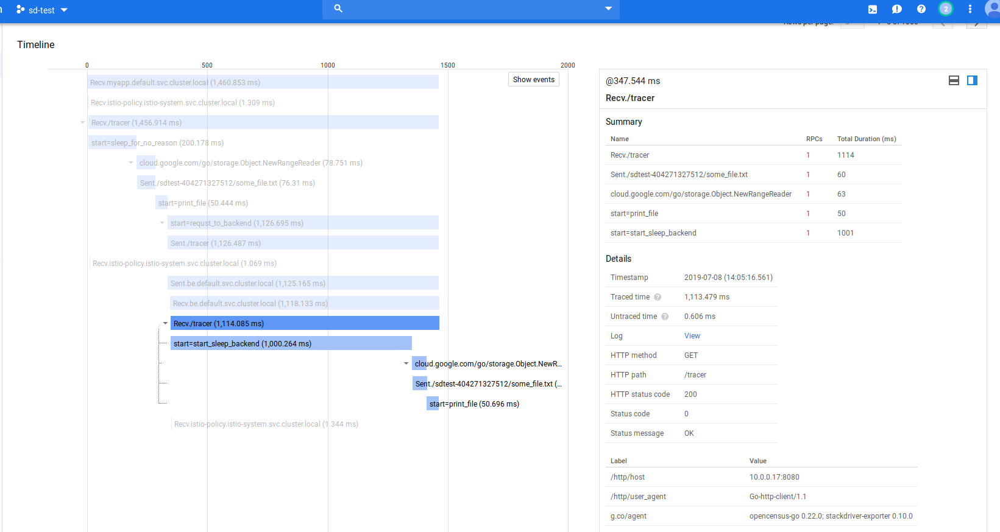


For more information see [Google Cloud Trace context propagation and metrics graphs with Grafana+Prometheus and Stackdriver](https://medium.com/google-cloud/google-cloud-trace-context-propagation-and-metrics-graphs-with-grafana-prometheus-and-stackdriver-e869a23a7abc)


#### Spans

If you want to start a span, just set the start/end:

```golang
	// Start Span
	_, fileSpan := trace.StartSpan(ctx, "start=print_file")

	time.Sleep(50 * time.Millisecond)
	fileSpan.End()
	// End Span
```

#### Propagation

If you want to propagate a trace from a frontend to backend, you need to bake in the context with the request:

```golang
	client := &http.Client{
		Transport: &ochttp.Transport{},
	}

	hreq, _ := http.NewRequest("GET", fmt.Sprintf("http://%v:%v/", backendHost, backendPort), nil)

	// add context to outbound http request
	hreq = hreq.WithContext(cc)
	rr, err := client.Do(hreq)
```

#### Trace->Log Linking

You can also link a given trace directly with a logEntry.  Unfortunately, you need to emit logs using the Cloud Logging API and not stdout as described in this repo.   If you instead emitted logs and specified the `trace` field in the [LogEntry](https://cloud.google.com/logging/docs/reference/v2/rest/v2/LogEntry) proto as shown here

```golang
  ctx := span.SpanContext()
  tr := ctx.TraceID.String()
  lg := client.Logger("spannerlab")
  trace := fmt.Sprintf("projects/%s/traces/%s", projectId, tr)
  lg.Log(logging.Entry{
  Severity: severity,
  Payload:  fmt.Sprintf(format, v...),
			Trace:    trace,
			SpanID:   ctx.SpanID.String(),
		})
```

You can see the log lines for a given trace

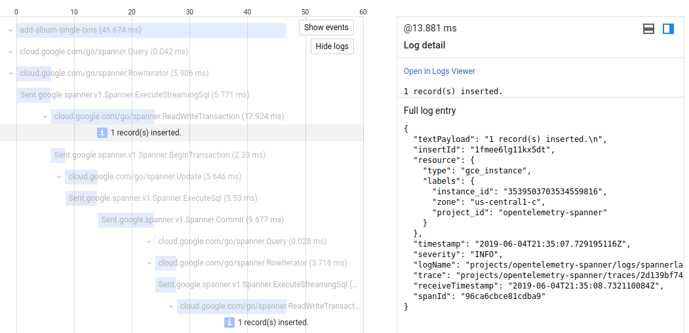

#### Parent-Child Log Linking

Its convenient to display all the log lines associated with a single request as one grouped log.  That is, if you emit N log lines within one httpRequest, you can 'expand' the parent http request log entry and see the subentries.   This is not available with the default logs to stdout on GKE nor is it available by default with the LoggingAPI.  Instead, you need to carefully construct the log entries in a specific sequence where the parent includes the `httpRequest` proto and child logs are linked with the traceID.  For more information, see [Correlating Log Lines on GCP](https://medium.com/google-cloud/combining-correlated-log-lines-in-google-stackdriver-dd23284aeb29)

### Metrics

There are two sections to monitoring here:

* Built in Stackdriver monitoring for istio
* Custom metrics


#### Built in SD metrics

Stackdriver provides automatic monitoring of certain istio statistics.  In our case, if saw that in the Kiali console but alertable via SD:

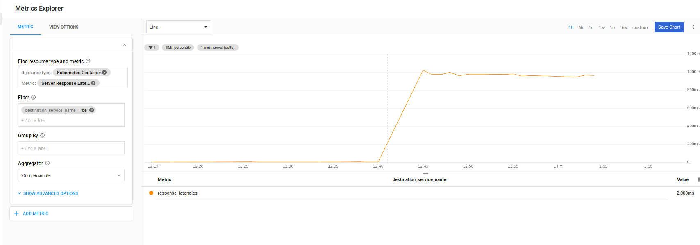

More more details on alerting based on Istio and SD metrics, please see the [istio samples](https://github.com/GoogleCloudPlatform/istio-samples/tree/master/istio-stackdriver#monitoring)

#### Custom Metrics

The sample here uses Opencensus libraries to emit metrics as well.  What this allows you do to is to emit any arbitrary _custom metric_ to any target supported.  The exporter we use here is ofcourse Stackdriver.

The configuration below describes a custom metric called `demo/simplemeasure` that has a dimension of `path` and describes a simple counter

```golang
	mCount     = stats.Int64("Count", "# number of called..", stats.UnitNone)
	keyPath, _ = tag.NewKey("path")
	countView  = &view.View{
		Name:        "demo/simplemeasure",
		Measure:     mCount,
		Description: "The count of calls per path",
		Aggregation: view.Count(),
		TagKeys:     []tag.Key{keyPath},
  }
```

We set this up in middleware

```golang
func trackVistHandler(next http.Handler) http.Handler {
	return http.HandlerFunc(func(w http.ResponseWriter, r *http.Request) {
		defer func() {
			ctx, err := tag.New(context.Background(), tag.Insert(keyPath, r.URL.Path))
			if err != nil {
				log.Println(err)
			}
			stats.Record(ctx, mCount.M(1))
		}()
		next.ServeHTTP(w, r)
	})
}
```

that intercepts every request to the `/measure` endpoint

```golang
http.Handle("/measure", trackVistHandler(measureHandler))
```

So..what does that custom metric do?  Well, its a trivial example:  all it does is increments a counter for every request to the `/measure` endpoint (or more accurately, any endpoint but we only enabled the interception for `/measure`).  The metric essentially says "create a custom metric that counts something and allow me to filter it on an label "path".   So if i enabled any other endpoint like `http.Handle("/backend", trackVistHandler(backendHandler))`, i would end up with a custom metric where i could see this counter and then filter it on the `path` (since i emit `r.URL.Path` as its label value)

Using a counter for visits to an endpoint is contrived (you could just use builtin metrics) but this demonstrates any custom attribute you can emit

* listing custom metrics
Now that we have custom metric defined, you can list it using the [monitoring.projects.metricDescriptors.list](https://developers.google.com/apis-explorer/#p/monitoring/v3/monitoring.projects.metricDescriptors.list?name=projects%252FYOURPROJECT0&_h=2&) endpoint.

Apply the filter to recall the metric set here
`metric.labels.path="/measure" AND resource.type="gke_container" AND metric.type="custom.googleapis.com/opencensus/demo/simplemeasure"`


* listing timeseries

You can list the timeseries using the [API explorer](https://developers.google.com/apis-explorer/#p/monitoring/v3/monitoring.projects.timeSeries.list?name=projects%252FPROJECT&filter=metric.labels.path%253D%2522%252Fmeasure%2522+AND+resource.type%253D%2522gke_container%2522+AND+metric.type%253D%2522custom.googleapis.com%252Fopencensus%252Fdemo%252Fsimplemeasure%2522&interval.endTime=2019-07-07T00%253A00%253A00%252B00%253A00&interval.startTime=2019-07-06T03%253A00%253A00%252B00%253A00&_h=29&) (just rest the timespan and the project name)


The custom metric renders as:

```json
{
 "timeSeries": [
  {
   "metric": {
    "labels": {
     "path": "/measure"
    },
    "type": "custom.googleapis.com/opencensus/demo/simplemeasure"
   },
   "resource": {
    "type": "gke_container",
    "labels": {
     "container_name": "",
     "namespace_id": "default",
     "instance_id": "2504921965430513151",
     "zone": "us-central1-a",
     "pod_id": "myapp-v1-846c6988db-96cbx",
     "project_id": "sd-test-246101",
     "cluster_name": "gcp-demo"
    }
   },
   "metricKind": "CUMULATIVE",
   "valueType": "INT64",
   "points": [
    {
     "interval": {
      "startTime": "2019-07-08T03:59:42.720343Z",
      "endTime": "2019-07-08T04:15:42.720367Z"
     },
     "value": {
      "int64Value": "16"
     }
    },
    {
     "interval": {
      "startTime": "2019-07-08T03:59:42.720343Z",
      "endTime": "2019-07-08T04:14:42.720435Z"
     },
     "value": {
      "int64Value": "16"
     }
    },
```

Ofcourse you can plot that after sending some traffic to the `/mesure` endpoint:

```bash
 for i in {1..100}; do curl -sk -w "\n" -s http://$GATEWAY_IP/measure &&  sleep 1; done
```

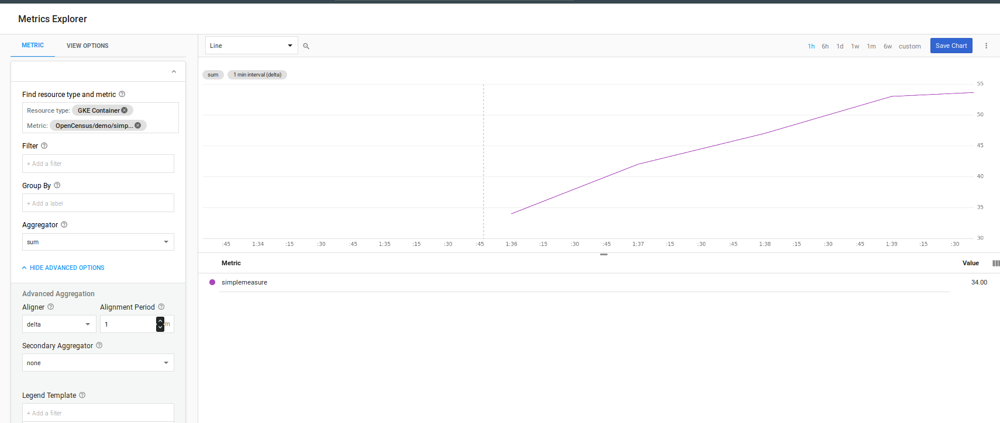

### Debugger and Profiler

If you deploy the Debug image and redeploy, you will enable the [Stackdriver Profiler](https://cloud.google.com/profiler/docs/profiling-go) and Debugger

edit `istio-deployment.yaml`

```yaml
apiVersion: extensions/v1beta1
kind: Deployment
metadata:
  name: myapp-v1
spec:
  replicas: 1
  template:
    metadata:
      labels:
        app: myapp
        version: v1
    spec:
      serviceAccountName: myapp-sa
      containers:
      - name: myapp-container
        #image: gcr.io/sd-test-246101/fe_min:1
        image: gcr.io/sd-test-246101/fe_min:debug1        
        imagePullPolicy: Always
```

I do not recommend this on _production traffic_ but if you need to setup a small sample to profile, debug with (see section on selective traffic allocation)

#### Profiling

Profiler takes sometime to gather the data but eventually you will see

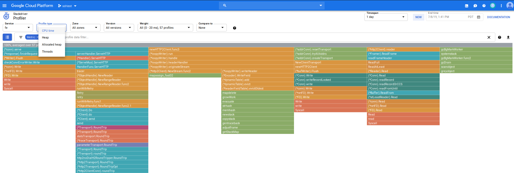

Which you can use to filter on cpu,heap, thread and other aspects of your running app

#### DEBUGGING

Cloud debugger allows you to inspect and inject log lines into your code.  It does *not* stop execution!

You will have to enable instrumentation on startup so its use isn't recommended on production traffic (only small portion, if its really necessary)

* as of `7/8/19`, cloud debugger portion of this repo is not working due to the way profiler/debugger starts up on Istio issue#[119](https://github.com/GoogleCloudPlatform/microservices-demo/issues/199#issuecomment-493283992)

I'll update this repo once that is resolved with actuall deebugger usage...for now, just a screenshot!

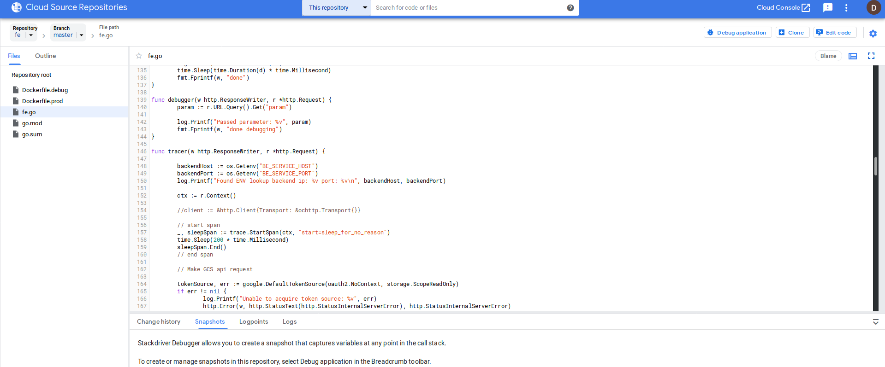


### ERROR REPORTING

[Cloud Error Reporting](https://cloud.google.com/error-reporting/) is enabled on all versions (not just debug!).  You can invoke it by going to the `/error` endpoint on the frontend.

The specific type of error that is being emitted is a golang customer error

```golang
type CustomError struct {
	Code    int
	Message string
}
func NewCustomError(code int, message string) *CustomError {
	return &CustomError{
		Code:    code,
		Message: message,
	}
}
func (e *CustomError) Error() string {
	return e.Message
}
```
WHich is directly invoked

```golang
	errorClient, err = errorreporting.NewClient(ctx, os.Getenv("GOOGLE_CLOUD_PROJECT"), errorreporting.Config{
		ServiceName: "fe",
		OnError: func(err error) {
			log.Printf("Could not log error: %v", err)
		},
	})
	err := NewCustomError(500, "Some random error")
	errorClient.Report(errorreporting.Entry{
		Error: err,
	})
```

and renders in the console as:

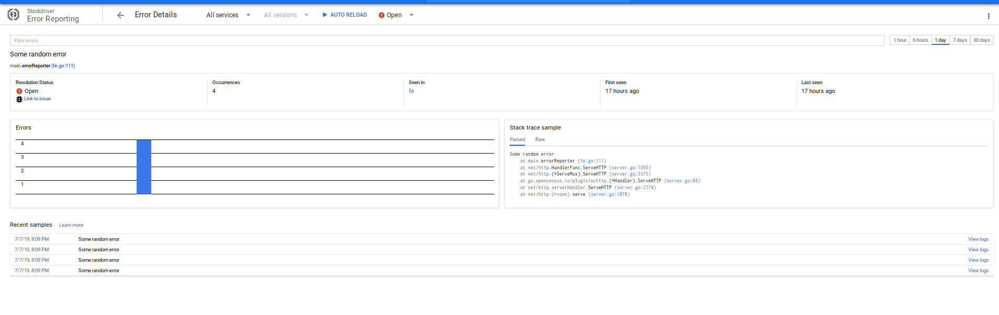

### Cleanup

Delete the cluster, gcs bucket, cloud source repo

### Conclusion

Thats it...that was a lot of ground to cover.  The intent of this was to provide a minimal sample that you can play around with...but at the end of the exercise, its still a lot...but its a lot to cover anyway.  If you see any improvements, please let me know under the issues section.


### Appendix

#### Kaili patch

Adds Kaili to the default installation of gke+istio

```bash
    cd istio_install
    export ISTIO_VERSION=1.1.7
    curl https://storage.googleapis.com/gke-release/istio/release/$GKE_ISTIO_VERSION/patches/install-prometheus.yaml
    | kubectl apply -n istio-system -f -
    wget https://github.com/istio/istio/releases/download/$ISTIO_VERSION/istio-$ISTIO_VERSION-linux.tar.gz
    tar xvzf istio-$ISTIO_VERSION-linux.tar.gz

    helm template --set kiali.enabled=false --namespace istio-system istio-$ISTIO_VERSION/install/kubernetes/helm/istio > off.yaml
    helm template --set kiali.enabled=true --set dashboard.username=admin --set dashboard.passphrase=admin --namespace istio-system istio-$ISTIO_VERSION/install/kubernetes/helm/istio > on.yaml
    diff -u off.yaml on.yaml > kiali.patch
    ```

    - edit kiali.path  [ accept all diffs ], or apply the one attached to this repo
```
